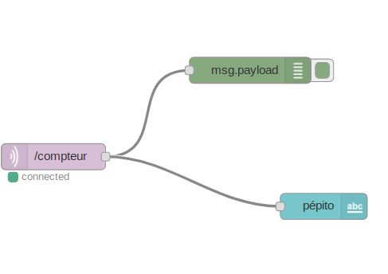

# liste-de-course

Compteur pour liste de course (ajout et suppression de produits)

# Node-red

# liste composant

+ 2 bouton push
+ 1 ESP 32
+ 2 resistances (aleatoire)
+ 4 cables male/male
+ 4 cables male/femelle
+ 1 cable micro USB
+ 1 breadboard

